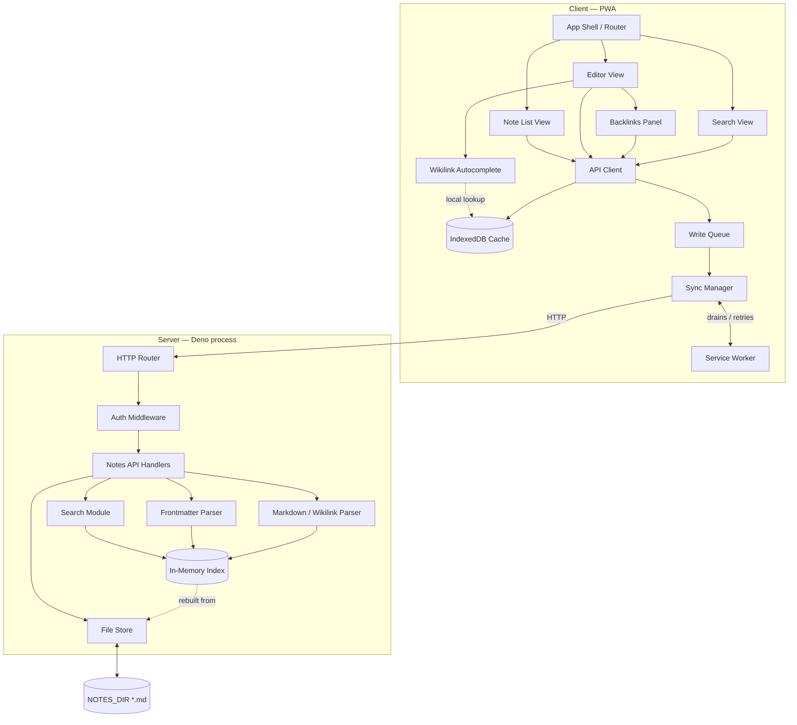

# noted — System Overview

A component-level breakdown of the architecture in `spec.md` §2 — what each piece is responsible for, what it talks to, and how data actually moves through the system for the flows that matter (opening notes, editing, going offline, linking). `techstack.md` names the concrete library/no-library choice behind each component below; `development.md` explains the functional-core / thin-OO-shell split that the "Implementation" column reflects.

## 1. Component inventory

### Client (PWA, runs in the browser — plain TS, native Web Components, no framework, no bundler: native ES modules via an import map, per `techstack.md`)

| Component | Responsibility | Implementation |
|---|---|---|
| **App Shell / Router** | Client-side view switching (list ↔ editor ↔ search ↔ tags); owns the top app bar and docked toolbar | Web Component; thin, mostly delegates |
| **Note List View** | Renders the note browser; filters by tag; triggers note open/create | Web Component; pure render from fetched data |
| **Editor View** | CodeMirror 6 instance with markdown-aware styling; owns save/autosave | Web Component wrapping a CodeMirror 6 instance |
| **Wikilink Autocomplete** | Subcomponent of Editor; watches for `[[`, queries the note-title cache, inserts links or creates notes | Pure filter function + a small stateful popup controller |
| **Backlinks Panel** | Subcomponent of Editor; shows notes linking to the currently open note | Web Component; pure render |
| **Search View** | Free-text query against the API (or local cache when offline) | Web Component |
| **API Client** | Thin fetch wrapper — every other client component goes through this, never calls `fetch` directly | Plain functions, no class needed |
| **IndexedDB Cache** | Local copy of the note list + recently-opened bodies, so the app has something to render with no connection | Small stateful wrapper around raw IndexedDB (no `idb` library) |
| **Write Queue** | Durable log of pending mutations (create/update/delete), written before any network attempt | Small stateful class — append/drain semantics |
| **Sync Manager** | Drains the Write Queue against the API when online; owns conflict detection | Stateful class — owns retry/backoff and conflict state |
| **Service Worker** | Precaches the app shell; intercepts fetches (stale-while-revalidate for API GETs, cache-first for assets); fires background-sync events | Hand-written, event-handler functions (no Workbox) |
| **Design tokens (CSS custom properties)** | Not a UI component but a dependency of all of them — see the [Field Guide](https://claude.ai/code/artifact/d937782c-06d1-4a54-a8c3-3136d7e027ed); every view above styles itself from these tokens, never a hardcoded value | Plain CSS, no preprocessor, no CSS-in-JS |

### Server (single long-running Deno process, no server framework — raw `Deno.serve`, per `techstack.md`)

| Component | Responsibility | Implementation |
|---|---|---|
| **Config Loader** | Reads `NOTES_DIR`, `PORT`, `AUTH_TOKEN` from env at boot | Pure function — env in, typed config object out |
| **HTTP Router** (`Deno.serve`) | Dispatches requests to handlers; the only thing the client ever talks to | Hand-rolled router function, no framework |
| **Auth Middleware** | Checks the shared token on every request before it reaches a handler | Pure function — request in, allow/deny out |
| **Notes API Handlers** | One handler per endpoint in spec.md §5 (list, get, create, update, delete, backlinks, search, tags) | Plain functions, one per endpoint |
| **Frontmatter Parser** | Reads/writes the YAML block at the top of a note file | Pure functions; small YAML lib (JSR-first, per `techstack.md`) |
| **Markdown/Wikilink Parser** | Parses a note body into HTML for preview, and separately extracts its outgoing `[[links]]` for indexing | Pure functions; `markdown-it` (or similar) + custom wikilink rule |
| **File Store** | The only component that touches disk — `readDir`/`readTextFile`/`writeTextFile`, slug generation, atomic writes | Thin I/O wrapper functions around `Deno.*` |
| **In-Memory Index** | filename → {title, tags, links, mtime}, plus the derived backlink graph and tag map; a cache, rebuildable from the File Store at any time | Stateful class — the one place mutable shared state lives on the server |
| **Search Module** | Queries the In-Memory Index (naive substring for v1) | Pure function over the Index's current snapshot |

### Filesystem

| Component | Responsibility |
|---|---|
| **`NOTES_DIR`** | The actual source of truth — one `.md` file per note. Everything server-side exists to read, write, and index this directory; nothing else stores note content. |

### Server module map (as built, M1–M3)

| File | Components it holds |
|---|---|
| `main.ts` | Boot sequence: `loadConfig` → `NoteIndex.build` → `createApp` → `Deno.serve` |
| `src/config.ts` | Config Loader (`loadConfig`, `ConfigError`) |
| `src/router.ts` | HTTP Router + the `createApp(config, { index, staticDir })` wiring: `/api/*` is auth-gated + dispatched; everything else falls through to the static shell; `ApiError` → JSON |
| `src/auth.ts` | Auth Middleware (`isAuthorized`) |
| `src/static.ts` | Static file server for the client shell (thin wrapper over `@std/http` `serveDir`) — **not auth-gated**, the browser must load the shell before it has a token |
| `src/handlers.ts` | Notes API Handlers, one per endpoint, plus request/response helpers |
| `src/frontmatter.ts` | Frontmatter Parser (`parseNote`, `normalizeFrontmatter`, `serializeNote`) |
| `src/markdown.ts` | Markdown/Wikilink Parser — `markdown-it` + custom `[[wikilink]]` rule; `extractWikilinkTargets`, `renderMarkdown`, `rewriteWikilinkTarget`, `firstWikilinkSnippet` |
| `src/note-index.ts` | In-Memory Index — `NoteIndex` class; entries + derived title/backlink/tag maps; `resolve`, `list`, `backlinkFilenames`, `outgoingLinksFor`, `upsert`/`remove`/`rename` |
| `src/file-store.ts` | File Store (list/read/write/delete/rename, `slugify`, `resolveNewFilename`, `parseFilename`, `noteMtime`) |
| `src/types.ts` | Shared types: `Filename` (branded), `Frontmatter`, note DTOs, `OutgoingLink`, `Backlink`, `Config`, `ApiError` |

**M3 read-path change:** `GET /api/notes` is now served from the In-Memory
Index with no disk I/O; `GET /api/notes/:filename` and the backlinks endpoint
still read the file for the body. Every write handler updates disk and then the
index in the same call; the derived maps are recomputed in full each time (see
`src/note-index.ts` header for why partial updates were rejected).

### Client module map (as built, M2)

Served straight from `public/` as ES modules — no bundler, no transpile step.

| File | Component |
|---|---|
| `public/index.html` | App shell document; loads `/app/main.js`, contains `<app-shell>` |
| `public/app/main.js` | Registers the custom elements |
| `public/app/app-shell.js` | App Shell / Router — `<app-shell>`, hash routing, top bar, auth-token field, status line; the only caller of the API Client |
| `public/app/note-list.js` | Note List View — `<note-list>`, pure render, emits intent events |
| `public/app/note-editor.js` | Editor View — `<note-editor>`, title + `<textarea>`, emits intent events; hosts the backlinks panel |
| `public/app/backlinks-panel.js` | Backlinks Panel — `<backlinks-panel>`, pure render, emits `note-open` |
| `public/app/api.js` | API Client — the one `fetch` wrapper; token in `localStorage`; `getBacklinks` added in M3 |
| `public/app/styles.css` | Placeholder styling; replaced by the M5 design-token set |

**Decision (M2):** client code is authored as plain `.js` with `// @ts-check` +
JSDoc, not `.ts`. It's the only option that is genuinely "no bundler, no build
step, native ES modules served directly" — the browser loads the exact file on
disk. `deno check` / `lint` / `fmt` still cover it (`compilerOptions.checkJs`,
`lib` includes `dom`). If the editor + sync-queue state gets hard to type this
way in M4–M6, the escalation paths already on record are an on-the-fly
transpile step or Preact (`spec.md` §3).

Search Module and the Wikilink Autocomplete are not built yet — they arrive in M4.

## 2. Dependency map

```
                              ┌────────────────────────┐
                              │   Design tokens (CSS)   │◀── styles every client view
                              └────────────────────────┘

  ┌───────────────┐   ┌───────────────┐   ┌───────────────┐   ┌───────────────┐
  │  Note List     │   │  Editor View   │   │  Search View   │   │  App Shell /   │
  │  View          │   │  ├ Wikilink AC │   │                │   │  Router        │
  │                │   │  └ Backlinks   │   │                │   │                │
  └───────┬────────┘   └───────┬────────┘   └───────┬────────┘   └───────┬────────┘
          │                    │                     │                    │
          └────────────────────┴──────────┬──────────┴────────────────────┘
                                           ▼
                                   ┌───────────────┐
                                   │  API Client    │
                                   └───────┬────────┘
                                           │
                     ┌─────────────────────┼─────────────────────┐
                     ▼                     ▼                     ▼
             ┌───────────────┐   ┌───────────────┐    ┌───────────────────┐
             │ IndexedDB      │   │ Write Queue    │───▶│ Sync Manager       │
             │ Cache          │   │                │    │ (conflict check)   │
             └───────────────┘   └───────────────┘    └─────────┬──────────┘
                                                                  │
                                                        (drained by)
                                                                  │
                                                       ┌──────────┴──────────┐
                                                       │  Service Worker      │
                                                       │  (sync event, cache) │
                                                       └──────────┬──────────┘
                                                                  │ HTTP
════════════════════════ network boundary ═══════════════════════│════════════
                                                                  ▼
                                                       ┌──────────────────┐
                                                       │   HTTP Router     │
                                                       └─────────┬────────┘
                                                                 │
                                                       ┌─────────▼────────┐
                                                       │  Auth Middleware  │
                                                       └─────────┬────────┘
                                                                 │
                                                       ┌─────────▼────────┐
                                                       │ Notes API         │
                                                       │ Handlers          │
                                                       └──┬──────────┬─────┘
                                                          │          │
                                        ┌─────────────────┘          └───────────────────┐
                                        ▼                                                 ▼
                              ┌───────────────────┐                             ┌───────────────────┐
                              │ Frontmatter Parser │                             │  Search Module     │
                              │ + Markdown/Wikilink│◀───────reads────────────────│  (queries index)   │
                              │   Parser           │                             └───────────────────┘
                              └─────────┬──────────┘
                                        │ extracted metadata + links
                                        ▼
                              ┌───────────────────┐         ┌───────────────────┐
                              │  In-Memory Index    │◀──────▶│   File Store       │
                              │  (titles, tags,     │ rebuilt│ (reads/writes .md) │
                              │   backlink graph)    │ from   └─────────┬─────────┘
                              └───────────────────┘                    │
                                                                        ▼
                                                              ┌───────────────────┐
                                                              │    NOTES_DIR        │
                                                              │  (.md files, source │
                                                              │   of truth)          │
                                                              └───────────────────┘
```



## 3. Key flows, step by step

**Boot** — Config Loader reads env → File Store scans `NOTES_DIR` → Frontmatter + Markdown/Wikilink Parser run once per file → In-Memory Index built (titles, tags, outgoing/back-links) → HTTP Router starts accepting requests. This whole sequence can re-run at any time to rebuild the index from scratch — it's a cache, never a migration.

**Opening the note list** — Note List View → API Client → `GET /api/notes` → Router → Auth → Handlers read straight from the In-Memory Index (no disk I/O on the read path) → JSON back to the client → API Client writes it into IndexedDB Cache → view renders. If offline, the same view renders straight from IndexedDB Cache and the API Client call never leaves the device.

**Editing and saving** — Editor View → save action → API Client writes to the Write Queue *first*, unconditionally → Sync Manager attempts the `PUT` immediately if online → Router → Auth → Handlers → File Store writes the file → Frontmatter/Markdown parser re-parses just that file → In-Memory Index updates that file's entry and recomputes backlinks for any note it links to → response clears the Write Queue entry. If offline, the queued entry just waits.

**Reconnecting** — Service Worker's `sync` event fires → Sync Manager drains the Write Queue in order → each `PUT` carries the client's last-seen `updated` timestamp → if the server's copy has moved on, Handlers return a conflict instead of overwriting → Sync Manager surfaces "keep mine / keep server's" to the Editor View rather than resolving it silently.

**Typing `[[`** — Wikilink Autocomplete reads from the IndexedDB Cache's title list first (instant, works offline); if the cache looks stale it debounces a `GET /api/search` through the API Client. Selecting an existing title inserts a link; selecting "create new" hands off to the same create flow as the note list's "new note" button.

**Opening a note's backlinks** — Backlinks Panel → API Client → `GET /api/notes/:id/backlinks` → Handlers reverse-look-up the In-Memory Index's backlink graph (already inverted at index-build time, not computed per request) → snippets returned and rendered.

**Deleting a note** — Handlers → File Store removes the file → In-Memory Index drops its entry and marks any note that linked to it as having an unresolved link → those notes' Backlinks/link rendering pick up the change next time they're fetched, not pushed proactively (no server-push in v1).

## 4. What's a cache vs. what's the source of truth

Only two things actually hold data permanently: **`NOTES_DIR`** on the server side and the **Write Queue** on the client side (it's the durability guarantee for something you typed before it's confirmed saved). Everything else — In-Memory Index, IndexedDB Cache, the Service Worker's asset cache — is disposable and gets rebuilt from one of those two. That's the property that makes the offline story tractable: a crash or a cleared cache never loses a note, only a rebuild step.

## 5. Reading the "Implementation" column

Every component above is one of three things, per `development.md` §1's functional-core / thin-OO-shell split: a **pure function** (parsing, filtering, config — no hidden state, trivial to unit test), a **stateful class** (the small number of places — the Index, the Write Queue, the Sync Manager, the IndexedDB Cache — that genuinely need to hold mutable state across calls), or a **Web Component / thin I/O wrapper** (the UI shell and the File Store, which exist to adapt one of the other two categories to the DOM or the filesystem). When a new component doesn't obviously fit one of these three, that's usually a sign it's trying to do two jobs at once and should split.
